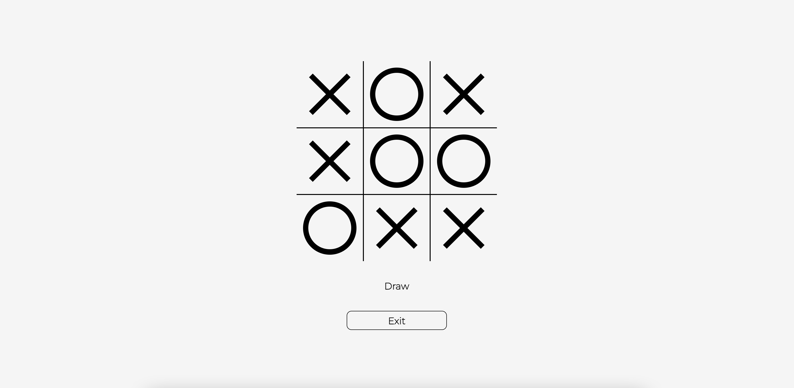

# Tic-Tac-Toe AI
## About

Implementation of an AI (minimax algorithm with alpha-beta pruning) for Tic-Tac-Toe.

The following screenshot is an example of the display for a completed game.



The ```original``` folder contains a vanilla JS implementation. The ```wasm-rust``` folder contains an implementation where parts of the code have been ported to Rust (check <a href="https://rustwasm.github.io/book/game-of-life/hello-world.html">here</a> for the setup methodology).